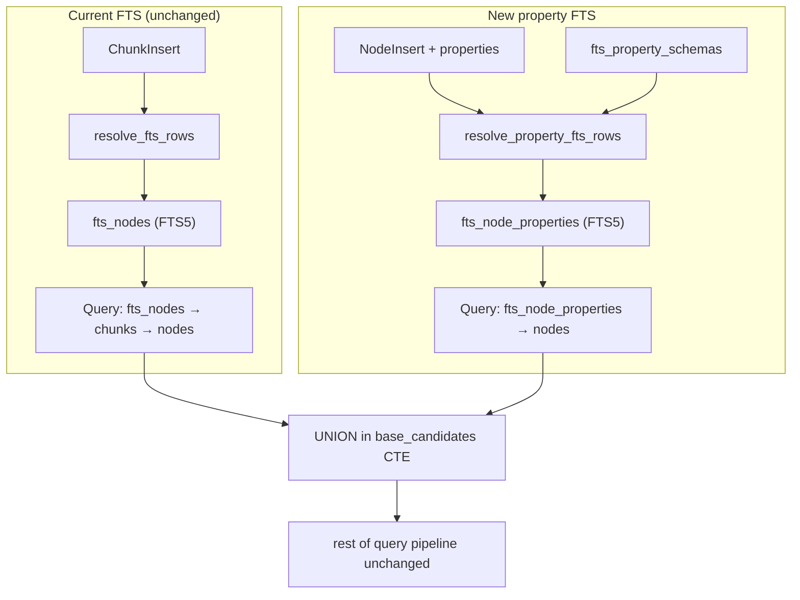

# Plan: Schema-Declared Full-Text Projections Over Structured Node Properties

## Context

FTS in fathomdb works exclusively through **chunks**: applications must manually
create `ChunkInsert` records containing text, and the engine derives FTS rows
from those chunks. Node `properties` (stored as JSONB) are invisible to
full-text search.

A node like `kind="person", properties={"name": "Alice Smith", "title":
"Engineer"}` is not discoverable via FTS unless the application manually creates
a chunk containing that text. This is tedious, error-prone, and on upsert the
app must remember to update synthetic chunks to match changed properties.

The goal: let node kinds declare which JSONB property paths should be projected
into FTS. The engine extracts, concatenates, and indexes those paths
automatically at write time — same atomicity contract as chunk-based FTS.

## Deliverables

Two files following the existing design/plan pattern:

1. **`dev/design-structured-node-full-text-projections.md`** — design document
   (feature definition, schema, behavior, trade-offs)
2. **`dev/plan-structured-node-full-text-projections.md`** — TDD implementation
   plan (slices with required tests and acceptance criteria)

These follow the same `design-*/plan-*` pair as
`design-operational-secondary-indexes.md` /
`plan-operational-secondary-indexes.md`.

## Architecture



**Key decision: separate `fts_node_properties` FTS5 table.**

The current `fts_nodes` table joins through `chunks` to reach `nodes`.
Property-derived FTS rows have no chunk. A new `fts_node_properties` virtual
table joins directly to `nodes` via `node_logical_id`. This keeps the chunk
model clean and makes rebuild straightforward — property FTS rebuilds from node
properties, chunk FTS rebuilds from chunk text.

## Design Document Content

The design doc
(`design-structured-node-full-text-projections.md`) will cover:

### Schema Registration

New table (migration `SchemaVersion(14)`):

```sql
CREATE TABLE IF NOT EXISTS fts_property_schemas (
    kind TEXT PRIMARY KEY,
    property_paths_json TEXT NOT NULL,  -- ["$.name","$.title","$.bio"]
    separator TEXT NOT NULL DEFAULT ' ',
    format_version INTEGER NOT NULL DEFAULT 1,
    created_at INTEGER NOT NULL DEFAULT (unixepoch())
);

CREATE VIRTUAL TABLE IF NOT EXISTS fts_node_properties USING fts5(
    node_logical_id UNINDEXED,
    kind UNINDEXED,
    text_content
);
```

Registration API:
- `register_fts_property_schema(kind, property_paths, separator)` — idempotent
  upsert
- `list_fts_property_schemas()` — returns all registered schemas
- `remove_fts_property_schema(kind)` — deregisters; explicit rebuild cleans up
  stale FTS rows

### Write-Path Integration

New struct in `writer.rs`:
```rust
struct FtsPropertyProjectionRow {
    node_logical_id: String,
    kind: String,
    text_content: String,
}
```

New fields in `PreparedWrite`:
```rust
property_fts_schemas: HashMap<String, Vec<String>>,  // kind → paths, loaded once per request
required_property_fts_rows: Vec<FtsPropertyProjectionRow>,
```

New function `resolve_property_fts_rows(conn, prepared)`:
- Called alongside `resolve_fts_rows`, before `BEGIN IMMEDIATE`
- For each node in `prepared.nodes`, looks up schema for the node's `kind`
- Extracts each declared path from `node.properties` via `serde_json::Value`
  path traversal
- Concatenates non-null values with the declared separator
- Skips nodes where all extracted values are null

In `apply_write`:
- For upsert nodes with property FTS schemas: `DELETE FROM fts_node_properties
  WHERE node_logical_id = ?` then insert
- For retired nodes: delete from `fts_node_properties` alongside existing
  `fts_nodes` delete

### Query Compiler Integration

Modify `DrivingTable::FtsNodes` in `compile.rs` to UNION `fts_node_properties`:

```sql
base_candidates AS (
    SELECT DISTINCT logical_id FROM (
        SELECT src.logical_id
        FROM fts_nodes f
        JOIN chunks c ON c.id = f.chunk_id
        JOIN nodes src ON src.logical_id = c.node_logical_id AND src.superseded_at IS NULL
        WHERE fts_nodes MATCH ?1 AND src.kind = ?2
        UNION
        SELECT fp.node_logical_id AS logical_id
        FROM fts_node_properties fp
        JOIN nodes src ON src.logical_id = fp.node_logical_id AND src.superseded_at IS NULL
        WHERE fts_node_properties MATCH ?3 AND fp.kind = ?4
    )
    LIMIT {base_limit}
)
```

The same sanitized FTS query and kind bind to both halves.

### Rebuild/Repair

New `rebuild_property_fts(conn)` in `projection.rs`:
1. `DELETE FROM fts_node_properties`
2. For each schema in `fts_property_schemas`, generate SQL per kind with
   `json_extract` for each path
3. Insert into `fts_node_properties` from active nodes

Integrate into `ProjectionService::rebuild_projections` under
`ProjectionTarget::Fts`.
Add property-FTS counterpart to `rebuild_missing_projections`.

### Scope Boundary

- Does not replace chunks (which handle long-form text and byte-range fragments)
- Does not support vector projection of properties
- Does not change the operational store
- Property extraction uses `serde_json` in Rust, not SQL-side `json_extract` at
  write time (properties are already in memory)
- Rebuild uses SQL-side `json_extract` (properties must be read from DB)

## Implementation Plan Content

The plan doc follows the TDD slice pattern from
`plan-operational-secondary-indexes.md`.

### Slice 1: Schema Persistence And Validation

**Work items:**
- Add `SchemaVersion(14)` migration: `fts_property_schemas` table +
  `fts_node_properties` FTS5 table
- Add bootstrap recovery helper `ensure_fts_property_schemas` (idempotent,
  following `ensure_operational_filter_contract` pattern)
- Add registration/read/remove admin methods on `AdminService`
- Parse and validate property paths (must be valid `$.` JSON paths, non-empty
  array, no duplicates)

**Required tests:**
- Failing test proving register/read round-trips `fts_property_schemas`
- Failing test proving idempotent re-registration with same paths succeeds
- Failing tests rejecting: empty paths array, malformed JSON paths, duplicate
  paths
- Failing bootstrap/recovery test proving the schema table survives intact

**Acceptance criteria:**
- FTS property schemas are durable per-kind metadata
- Malformed schemas fail before any metadata mutation
- Bootstrap/recovery preserve the schema

**Files:** `crates/fathomdb-schema/src/bootstrap.rs`,
`crates/fathomdb-engine/src/admin.rs`

### Slice 2: Write-Time Property Extraction And FTS Projection

**Work items:**
- Add `FtsPropertyProjectionRow` struct and `required_property_fts_rows` field
  to `PreparedWrite`
- Implement `resolve_property_fts_rows(conn, prepared)` — loads schemas from DB,
  extracts property paths, concatenates with separator
- Insert property FTS rows in `apply_write` transaction, after chunk FTS inserts

**Required tests:**
- Failing test proving property FTS row exists after writing a node whose kind
  has a registered schema
- Failing test proving extracted text content matches the declared property
  values concatenated with separator
- Failing test proving a node whose kind has no registered schema produces no
  property FTS row
- Failing test proving nodes where all declared paths are absent/null produce no
  FTS row
- Failing test proving multiple nodes in one write request each get correct
  property FTS rows

**Acceptance criteria:**
- Property FTS rows commit atomically with canonical writes
- Extraction is correct for present, absent, and mixed property paths
- No property FTS rows for unregistered kinds

**Files:** `crates/fathomdb-engine/src/writer.rs`

### Slice 3: Upsert And Retire Lifecycle

**Work items:**
- On upsert (node with `upsert=true`): delete old `fts_node_properties` row for
  that `node_logical_id`, insert new one from updated properties
- On node retire: delete from `fts_node_properties` alongside existing
  `fts_nodes` delete
- On excise by source_ref: ensure property FTS rows are cleaned up

**Required tests:**
- Failing test proving upsert replaces property FTS content with new property
  values
- Failing test proving old property values are no longer in FTS after upsert
- Failing test proving retire deletes property FTS rows
- Failing test proving excise_source cleans up property FTS rows

**Acceptance criteria:**
- Property FTS stays in sync across all lifecycle operations
- No stale FTS rows survive upsert or retire

**Files:** `crates/fathomdb-engine/src/writer.rs` (upsert/retire/excise paths)

### Slice 4: Query Compiler Integration

**Work items:**
- Modify `DrivingTable::FtsNodes` branch in `compile.rs` to UNION
  `fts_node_properties`
- Duplicate the FTS match bind + kind bind for the second half of the UNION
- Update shape signature in `plan.rs` to account for property FTS presence

**Required tests:**
- Failing test proving `text_search` finds a node that has matching text only in
  properties (not chunks)
- Failing test proving `text_search` finds nodes from both chunks and properties
  in the same query
- Failing test proving compiled SQL includes the UNION when property schemas
  exist
- Failing test proving bind parameter indices are correct in the UNION query

**Acceptance criteria:**
- FTS search transparently covers both chunk-derived and property-derived text
- No query compiler regression for chunk-only FTS (existing tests remain green)

**Files:** `crates/fathomdb-query/src/compile.rs`,
`crates/fathomdb-query/src/plan.rs`

### Slice 5: Rebuild And Repair

**Work items:**
- Add `rebuild_property_fts(conn)` in `projection.rs`
- Integrate into `rebuild_projections(ProjectionTarget::Fts)` and
  `rebuild_projections(ProjectionTarget::All)`
- Add `rebuild_missing_property_fts` counterpart for missing-projection
  detection
- Generate per-kind SQL dynamically from `fts_property_schemas` using
  `json_extract`

**Required tests:**
- Failing test proving `rebuild_projections(Fts)` regenerates property FTS rows
  from canonical node state
- Failing test proving rebuild works correctly when schema has multiple property
  paths
- Failing test proving `rebuild_missing_projections` fills in property FTS rows
  for nodes that lack them
- Failing test proving rebuild produces zero rows for kinds with no registered
  schema

**Acceptance criteria:**
- Property FTS is fully rebuildable from canonical state + registered schemas
- `rebuild_projections` handles both chunk FTS and property FTS
- Missing-projection detection covers property FTS

**Files:** `crates/fathomdb-engine/src/projection.rs`

### Slice 6: Cross-Surface Parity

**Work items:**
- Expose `register_fts_property_schema`, `list_fts_property_schemas`,
  `remove_fts_property_schema` through the Rust `Engine` facade
- Add Python SDK bindings in `_engine.py` / `_admin.py` / `_types.py`
- Add TypeScript SDK bindings
- Add bridge request types for Go admin tooling

**Required tests:**
- Failing Rust facade test for register/list/remove
- Failing Python binding test for schema registration and FTS search finding
  property-derived results
- Failing TypeScript binding test for equivalent flow
- Failing bridge/Go request-shape test

**Acceptance criteria:**
- All language surfaces can manage FTS property schemas
- Search results are consistent across languages

**Files:** `crates/fathomdb/src/lib.rs`, `python/fathomdb/_engine.py`,
`python/fathomdb/_admin.py`, `python/fathomdb/_types.py`,
`typescript/packages/fathomdb/src/`

## Verification Matrix

The implementation is complete only when all of the following pass:

- Targeted Rust engine/admin/writer tests for schema persistence, property
  extraction, lifecycle, and rebuild
- Query compiler tests for UNION generation and bind correctness
- Rust facade tests
- Python binding tests
- TypeScript binding tests
- Bridge/Go request-shape tests
- `cargo test --workspace`
- `cargo test --workspace --features sqlite-vec`
- `go test ./...`
- `python -m pytest python/tests -q`

## Execution Order

1. Land schema persistence and validation first (stable metadata source for all
   later slices)
2. Land write-time extraction before lifecycle handling (need basic writes before
   testing upsert/retire)
3. Land lifecycle before query compiler (ensure FTS state is correct before
   search exercises it)
4. Land query compiler before rebuild (search must work before testing
   rebuild-then-search)
5. Land rebuild before cross-surface parity (core feature complete before SDK
   exposure)

## Critical Files

| File | Role |
|------|------|
| `crates/fathomdb-schema/src/bootstrap.rs` | Migration 14, bootstrap recovery |
| `crates/fathomdb-engine/src/writer.rs` | Property extraction, FTS projection, lifecycle |
| `crates/fathomdb-engine/src/projection.rs` | Rebuild/repair |
| `crates/fathomdb-engine/src/admin.rs` | Registration API |
| `crates/fathomdb-query/src/compile.rs` | UNION in FTS driving table |
| `crates/fathomdb-query/src/plan.rs` | Shape signature update |
| `crates/fathomdb/src/lib.rs` | Public Engine facade |
| `python/fathomdb/_engine.py`, `_admin.py`, `_types.py` | Python bindings |

## Existing Code To Reuse

- `resolve_fts_rows` pattern (`writer.rs:873-926`) — sibling function for
  property extraction
- `FtsProjectionRow` struct (`writer.rs:240-245`) — template for
  `FtsPropertyProjectionRow`
- `rebuild_fts` (`projection.rs:120-136`) — template for
  `rebuild_property_fts`
- `ensure_operational_filter_contract` (`bootstrap.rs:598-631`) — template for
  bootstrap recovery helper
- `sanitize_fts5_query` (`compile.rs`) — reuse for property FTS MATCH bind
- Node retire FTS cleanup (`writer.rs:1284`, `writer.rs:1318`) — extend with
  `fts_node_properties` delete

## Addendum: Implementation Divergences

The following changes were made during implementation that differ from this plan
as originally approved:

- **SchemaVersion(15)**, not 14 — SchemaVersion(14) was already taken by
  external content object columns.
- **No `PropertyTextSearch` query step** — the plan's Slice 4 originally
  proposed a separate `PropertyTextSearch` AST variant. During implementation
  this was replaced: `text_search(...)` transparently UNIONs both
  `fts_nodes` and `fts_node_properties`, so the user-facing query surface is
  unchanged.
- **Upsert always deletes property FTS rows** — the plan's Slice 3 described
  deleting on upsert when the schema matches. The implementation unconditionally
  deletes property FTS rows on any upsert (properties always change), not
  gated on `ChunkPolicy::Replace`.
- **`describe_fts_property_schema`** was added as a fourth admin method
  (single-kind lookup) alongside register/list/remove.
