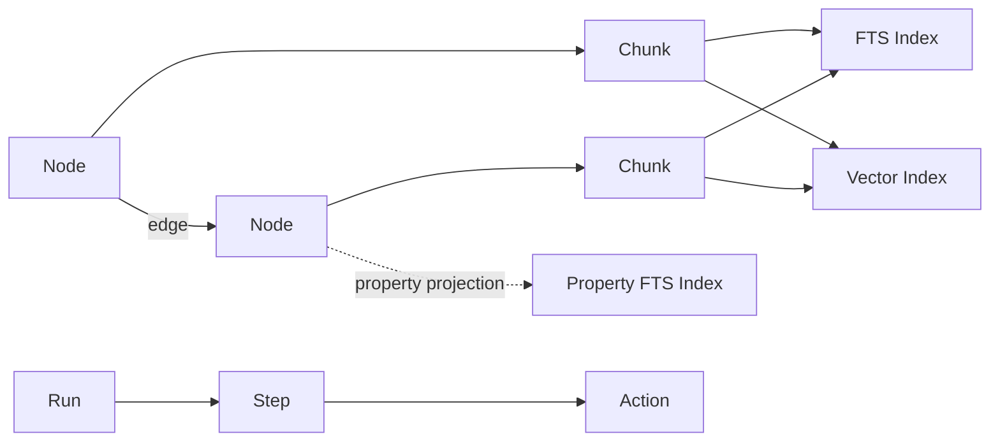

# Data Model

fathomdb stores your application's data as a graph of **nodes** and **edges**,
with **chunks** that project text into full-text and vector search indexes. A
small set of **run/step/action** tables tracks agent execution history, and
every write carries **provenance** metadata for traceability and repair.



## Nodes

A **node** is the primary data record. Every node has:

| Field | Purpose |
|---|---|
| `kind` | An application-defined type label (e.g. `"person"`, `"meeting"`, `"task"`). You choose your own taxonomy. |
| `properties` | A JSON object holding the node's data. The schema is flexible -- the engine does not enforce a fixed shape. |
| `logical_id` | A stable identifier for the real-world entity this node represents. It persists across updates. |
| `row_id` | A unique identifier for this specific *version* of the node. Each update creates a new row. |
| `source_ref` | Provenance link to the execution context that created this version. |
| `content_ref` | Optional URI referencing external content (see [External Content](#external-content)). |

### logical_id vs row_id

This split is central to how fathomdb handles updates:

- **`logical_id`** identifies the entity itself. When you update a person's
  email address, the `logical_id` stays the same.
- **`row_id`** identifies one particular version of that entity. An update
  creates a new row (with a new `row_id`) and marks the old row as superseded.
  The old version is preserved, not deleted.

Edges and chunks reference nodes by `logical_id`, so relationships and search
indexes automatically resolve to the current version. You can also query
historical state by time range.

```python
node = builder.add_node(
    row_id="01J5A...",
    logical_id="person-alice",
    kind="person",
    properties={"name": "Alice", "role": "engineer"},
    source_ref="run/ingest-contacts/step/1",
)
```

## Edges

An **edge** connects two nodes and represents a typed relationship. Edges have
their own `kind`, `properties`, `logical_id`, and `row_id`, following the same
versioning model as nodes.

Edges reference nodes by `logical_id`, not `row_id`. This means relationships
survive node updates without requiring edge rewrites.

```python
builder.add_edge(
    row_id="01J5B...",
    logical_id="alice-attended-standup",
    source=node,          # NodeHandle or logical_id string
    target="meeting-standup-0405",
    kind="attended",
    properties={"role": "presenter"},
    source_ref="run/ingest-calendar/step/3",
)
```

## External Content

A node can reference **external content** -- a PDF, web page, media file, or
dataset that lives outside fathomdb -- via its `content_ref` field. This is an
optional URI string stored on the node row.

| Field | Purpose |
|---|---|
| `content_ref` (node) | URI pointing to the external content (e.g. `s3://bucket/report.pdf`, `https://example.com/dataset.csv`). |
| `content_hash` (chunk) | Hash of the external content at the time the chunk was derived from it (e.g. `sha256:abc123`). Used for staleness detection. |

External content nodes are ordinary nodes -- the engine does not fetch, cache,
or interpret the URI. Your application layer manages content lifecycle
(ingestion, refresh, staleness checks) while the engine stores the metadata,
text extractions, and search indexes.

```python
node = builder.add_node(
    row_id="01J5B...",
    logical_id="report-q4",
    kind="document",
    properties={"title": "Q4 Report", "mime_type": "application/pdf"},
    content_ref="s3://docs/q4-report.pdf",
)
chunk = builder.add_chunk(
    id="01J5C...", node=node,
    text_content="Revenue grew 15% quarter over quarter...",
    content_hash="sha256:9f86d08...",
)
```

You can query for content nodes using `filter_content_ref_not_null()` (all nodes
with external content) or `filter_content_ref_eq(uri)` (exact URI match). See
[Querying Data](../guides/querying.md) for details.

## Chunks

A **chunk** is a text fragment associated with a node. Chunks are the bridge
between the graph and the search indexes. When you create a chunk, its text is
automatically projected into:

- **Full-text search (FTS)** -- for keyword and phrase matching
- **Vector search** -- for semantic similarity (when an embedding is provided)

Search queries return chunks, which resolve back to their parent nodes. This
means you can find a node by searching for text it contains, even when that text
is spread across multiple chunks.

!!! tip "Structured nodes without chunks"

    If your node kind stores searchable text in JSON properties rather than
    document chunks (e.g. goals, tasks, contacts), you can register an **FTS
    property projection** instead of creating chunks. The engine extracts
    declared property paths at write time and indexes them for full-text
    search. The unified `search(...)` entry point — and the advanced
    `text_search(...)` override — transparently covers both chunk-backed
    and property-backed results, using the same safe subset of terms,
    quoted phrases, implicit `AND`, uppercase `OR`, and uppercase `NOT`
    documented in the querying guide. Unsupported syntax stays literal
    rather than passing through as raw FTS5 control syntax. See
    [Property FTS Projections](../guides/property-fts.md).

```python
chunk = builder.add_chunk(
    id="01J5C...",
    node=node,              # NodeHandle or logical_id string
    text_content="Alice presented the Q2 roadmap and discussed timeline risks.",
)

# Optionally attach a vector embedding
builder.add_vec_insert(chunk=chunk, embedding=[0.12, -0.03, ...])
```

## Runs, Steps, and Actions

These three record types form an execution hierarchy for tracking agent work:

| Record | Purpose |
|---|---|
| **Run** | A top-level execution container (a session, a scheduled job, a pipeline invocation). |
| **Step** | A stage within a run (an LLM call, a retrieval pass, a decision point). |
| **Action** | A concrete outcome within a step (a tool call, an observation, a write). |

Each has a `kind`, `status`, and flexible `properties`, following the same
pattern as nodes.

```python
run = builder.add_run(
    id="01J5D...", kind="ingest", status="running", properties={}
)
step = builder.add_step(
    id="01J5E...", run=run, kind="extract", status="completed",
    properties={"model": "gpt-4o"},
)
action = builder.add_action(
    id="01J5F...", step=step, kind="tool_call", status="completed",
    properties={"tool": "calendar.list"},
)
```

The run/step/action hierarchy is optional. Use it when you need to trace *why*
data was written, or to replay and evaluate agent behavior.

## The Engine/Application Boundary

fathomdb provides a small set of storage primitives -- nodes, edges, chunks,
runs, steps, and actions. Your application's domain concepts are modeled as
nodes and edges with application-chosen `kind` values. For example:

- A meeting is a node with `kind="meeting"`
- A person is a node with `kind="person"`
- Attendance is an edge with `kind="attended"`

The engine does not define or enforce a schema for these kinds. You choose your
own type taxonomy and property shapes. The engine handles versioning, indexing,
provenance, and search across whatever structure you define.

## Provenance

Every write accepts an optional `source_ref` string that links the data back to
the execution context that produced it. Typically this references a run, step,
or action ID, but it can be any string meaningful to your application.

Provenance enables two important operations:

- **Trace** (`trace_source`): find everything created by a given source
  reference. Useful for debugging and auditing agent behavior.
- **Excise** (`excise_source`): remove everything created by a given source
  and restore any previously active versions. This is how you surgically undo
  the damage from a bad agent run without rolling back unrelated work.

For full type definitions, see the [types reference](../reference/types.md).
For practical usage, see [writing data](../guides/writing-data.md) and
[querying](../guides/querying.md).
